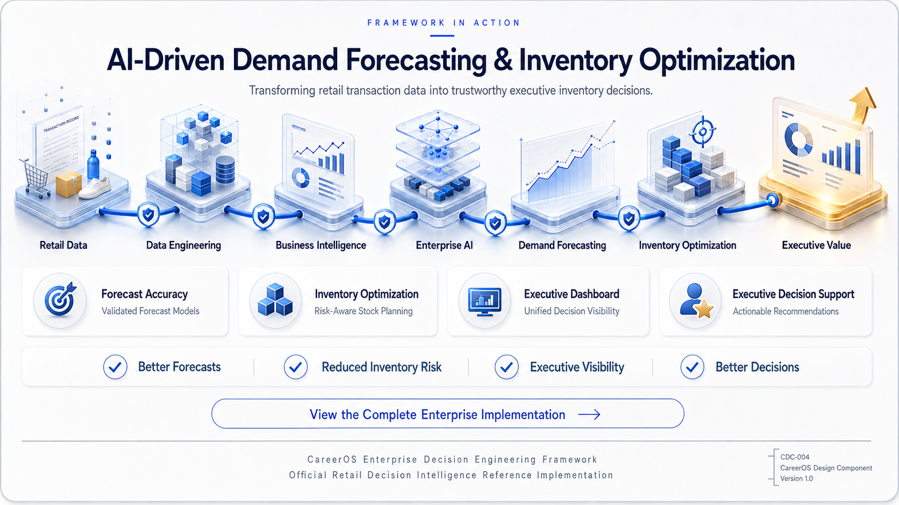
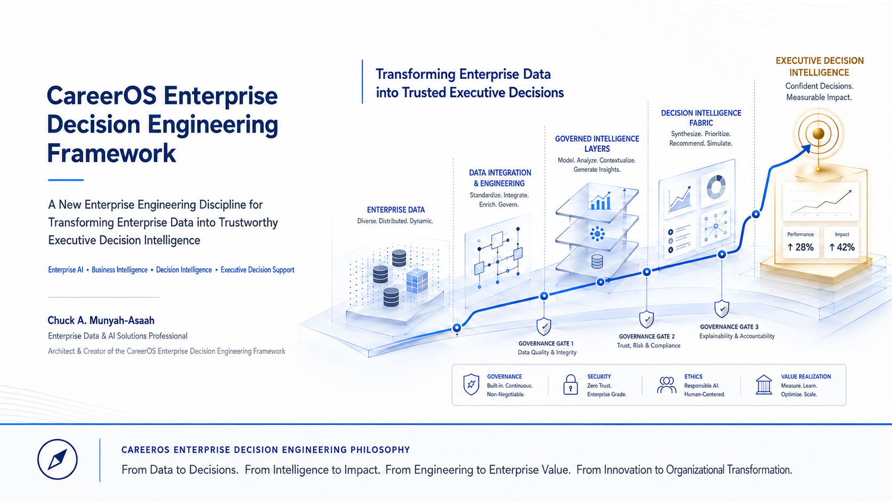
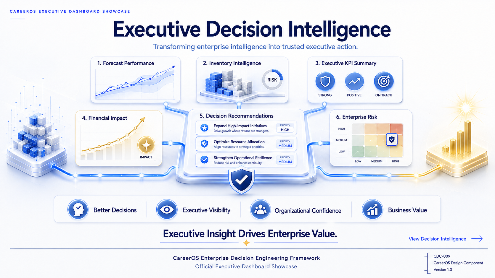

# AI-Driven Demand Forecasting & Inventory Optimization

## Official Retail Decision Intelligence Reference Implementation

### CareerOS Enterprise Decision Engineering Framework (CEDEF)

*Demonstrating how Enterprise Decision Engineering transforms enterprise intelligence into trustworthy operational and executive decisions.*

 

 

**CareerOS Reference Implementation Portal**

Official Enterprise Solution Showcase

Enterprise AI • Predictive Intelligence • Inventory Optimization • Executive Decision Support

---

# Executive Summary

The **AI-Driven Demand Forecasting & Inventory Optimization** repository is the official retail reference implementation of the **CareerOS Enterprise Decision Engineering Framework (CEDEF).**

Rather than demonstrating machine learning in isolation, this implementation illustrates how Enterprise Decision Engineering systematically transforms enterprise data into governed intelligence, operational planning, inventory optimization, and trustworthy executive decision support.

The repository serves as a practical demonstration of how the principles introduced in the CareerOS Framework can be applied to solve real-world enterprise challenges.

It bridges the gap between enterprise architecture and enterprise implementation.

Visitors will discover how enterprise data progresses through governed engineering processes, predictive intelligence, decision intelligence, and executive decision support to create measurable organizational value.

---

# Business Challenge

Retail organizations continuously face one critical question.

> **How much inventory should be ordered to satisfy customer demand while minimizing cost, inventory risk, and operational uncertainty?**

Traditional analytics initiatives often conclude with predictive models or demand forecasts.

Enterprise Decision Engineering extends that journey.

Predictions become operational planning.

Operational planning becomes inventory intelligence.

Inventory intelligence becomes executive decision support.

The objective is not simply to forecast demand.

The objective is to engineer better business decisions.

---

### Signature Visual SV-001

**Enterprise Decision Intelligence Journey**

*Illustrates the progressive transformation of enterprise data into trustworthy executive decision intelligence through the CareerOS Enterprise Decision Engineering Framework.*

---

# Solution Overview

The CareerOS Enterprise Decision Engineering Framework provides the engineering methodology that enables this transformation.

Rather than organizing analytics as disconnected activities, the framework integrates enterprise data, business intelligence, artificial intelligence, predictive intelligence, decision intelligence, and executive decision support into one governed enterprise engineering lifecycle.

The result is an enterprise solution that not only predicts future demand but also supports inventory planning, executive reporting, operational governance, and strategic organizational decision-making.

---

### Signature Visual SV-002

**Enterprise Decision Engineering Architecture**

*Illustrates the six integrated enterprise capabilities that systematically transform enterprise intelligence into trustworthy executive decision-making.*

# Technology Stack

This reference implementation combines enterprise data engineering, business intelligence, artificial intelligence, predictive analytics, and executive decision support technologies into a unified enterprise engineering solution.

Rather than selecting technologies in isolation, every component has been chosen to support a specific capability within the CareerOS Enterprise Decision Engineering Framework.

---

## Enterprise Data Engineering

Building trusted enterprise data foundations.

**Technologies**

- Python
- SQL
- Pandas
- NumPy

---

## Business Intelligence & Analytics

Transforming enterprise information into actionable business insight.

**Technologies**

- Power BI
- Tableau
- Executive KPI Engineering
- Enterprise Reporting

---

## Enterprise Artificial Intelligence

Engineering intelligent enterprise capabilities for forecasting and decision support.

**Technologies**

- Scikit-learn
- XGBoost
- TensorFlow
- Statsmodels

---

## Predictive Intelligence

Forecasting future enterprise conditions to reduce operational uncertainty.

**Techniques**

- ARIMA
- Random Forest
- Linear Regression
- LSTM
- Time-Series Forecasting

---

## Enterprise Data Platforms

Providing secure, scalable enterprise data infrastructure.

**Platforms**

- PostgreSQL
- MySQL
- MongoDB
- AWS
- Git
- GitHub

---

# Repository Organization

The repository has been organized according to the CareerOS engineering philosophy, separating enterprise assets into reusable engineering components.

| Directory | Purpose |
|-----------|---------|
| `data/` | Enterprise datasets used throughout the engineering lifecycle |
| `documentation/` | Engineering documentation, methodology, and supporting publications |
| `images/` | Design components, Signature Visuals, dashboards, and architecture illustrations |
| `notebooks/` | Engineering Packages, analytical notebooks, and experimentation |
| `reports/` | Executive reports, dashboards, and decision-support artifacts |
| `src/` | Enterprise engineering source code |
| `presentations/` | Executive briefings and presentation materials |

---

# Business Outcomes

The objective of this implementation extends well beyond demand forecasting.

The solution has been engineered to improve enterprise decision-making by transforming predictive intelligence into operational action.

The implementation demonstrates how Enterprise Decision Engineering supports:

- 📈 Demand Forecasting
- 📦 Inventory Optimization
- 🧠 Decision Intelligence
- 📊 Business Intelligence
- 🤖 Enterprise Artificial Intelligence
- 👔 Executive Decision Support
- 🛡 Enterprise Governance
- 📈 Organizational Performance

Ultimately, the implementation delivers governed enterprise intelligence capable of supporting inventory planning, operational management, executive reporting, and strategic organizational decision-making.

---

# Enterprise Deliverables

The reference implementation produces multiple enterprise decision artifacts that support different levels of organizational decision-making.

These include:

- Executive Forecast Dashboard
- Inventory Planning Dashboard
- Economic Decision Dashboard
- Executive Decision Dashboard
- Enterprise KPI Dashboard
- Framework Certification Dashboard

Each deliverable contributes toward transforming enterprise intelligence into actionable executive decision support.

---

### Enterprise Engineering in Action

*From enterprise data to executive decisions.*

# Dashboard Gallery

Enterprise Decision Engineering produces more than analytical models.

It produces governed enterprise decision artifacts that support operational planning, executive reporting, and strategic organizational decision-making.

The following illustration represents the executive dashboard ecosystem produced by the CareerOS Enterprise Decision Engineering Framework.

### CDC-009 — Executive Dashboard Showcase

*Illustrates the integrated executive dashboards that transform enterprise intelligence into actionable operational, tactical, and strategic decision support.*

---

As the reference implementation continues to evolve, this repository will publish a growing collection of enterprise dashboards demonstrating how governed enterprise intelligence becomes measurable organizational value.

Current and planned executive dashboards include:

- 📈 Enterprise Forecast Dashboard
- 📦 Inventory Planning Dashboard
- 💰 Economic Decision Dashboard
- 👔 Executive Decision Dashboard
- 📊 Enterprise KPI Dashboard
- 📑 Framework Certification Dashboard

Each dashboard has been engineered to support a specific level of enterprise decision-making while remaining fully aligned with the CareerOS Enterprise Decision Engineering Framework.

Together, these dashboards illustrate how Enterprise Decision Engineering transforms enterprise data into trusted executive intelligence capable of supporting operational planning, executive governance, organizational performance, and strategic decision-making.

---

# Explore the CareerOS Ecosystem

This implementation is one component of the broader CareerOS ecosystem.

Together, the CareerOS repositories guide visitors through a complete enterprise engineering journey:

Executive Vision

↓

Enterprise Framework

↓

Enterprise Implementation

↓

Organizational Transformation

Together, the CareerOS repositories provide a complete enterprise engineering journey—from executive vision, to enterprise framework, to real-world implementation.

| Repository | Purpose |
|------------|---------|
| 🏠 **Executive Portal** | Meet the architect and explore the CareerOS vision |
| 📘 **Framework Portal** | Discover the CareerOS Enterprise Decision Engineering Framework (CEDEF) |
| 🛍 **Reference Implementation Portal** | Experience Enterprise Decision Engineering through a practical enterprise solution |

Future repositories will continue expanding the CareerOS ecosystem with additional enterprise implementations, executive publications, engineering standards, intelligent software, and educational resources.

---

# Future Roadmap

The CareerOS Enterprise Decision Engineering Framework has been intentionally designed as an industry-independent enterprise engineering discipline.

Future reference implementations will extend the framework into additional domains, including:

- 🏥 Healthcare Decision Intelligence
- 🏦 Banking Decision Intelligence
- 🏛 Government Decision Intelligence
- 🏭 Manufacturing Decision Intelligence
- 🎓 Higher Education Decision Intelligence
- ⚡ Energy Decision Intelligence
- 🚚 Supply Chain Decision Intelligence

Each implementation will demonstrate how Enterprise Decision Engineering can be adapted to solve complex enterprise challenges while preserving the same governed engineering principles.

---

# License

This repository is released under the **MIT License**.

You are welcome to explore, learn from, and build upon this work in accordance with the terms of the license.

---

# Citation

If you reference this implementation in research, publications, presentations, or professional work, please cite:

**Chuck A. Munyah-Asaah**

*AI-Driven Demand Forecasting & Inventory Optimization*

Official Retail Decision Intelligence Reference Implementation

CareerOS Enterprise Decision Engineering Framework (CEDEF)

Version 1.0

2026

---

# CareerOS Enterprise Decision Engineering Philosophy

> **From Data to Decisions.**

> **From Intelligence to Impact.**

> **From Engineering to Enterprise Value.**

> **From Innovation to Organizational Transformation.**

 

---

### CareerOS™

### Enterprise Decision Engineering Framework (CEDEF)

**Official Retail Decision Intelligence Reference Implementation**

**Version 1.0**

